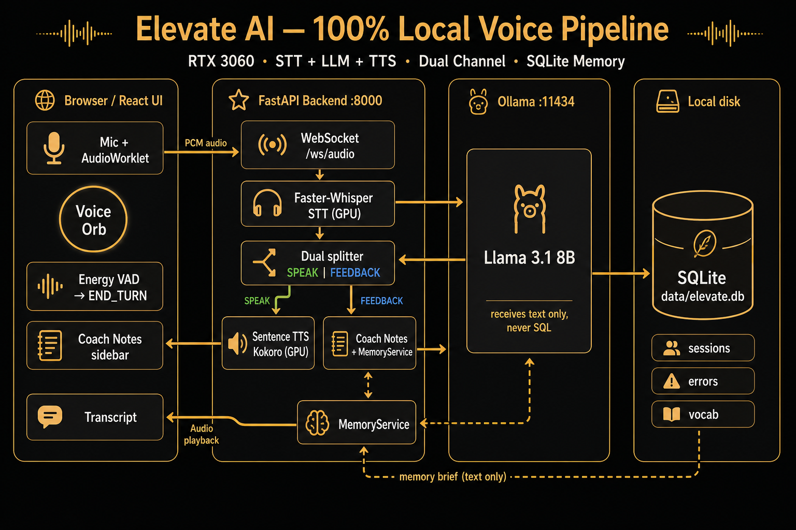

# Elevate AI

Tutor de inglés por voz **100% local** (STT → LLM → TTS) en una **RTX 3060 12GB**. Sin APIs cloud en el camino crítico.



Guía operativa en español. La landing principal (EN) es [`README.md`](README.md). Arquitectura: [`docs/architecture.md`](docs/architecture.md).

## Estado

| Fase | Alcance | Estado |
|------|---------|--------|
| 1 | Inferencia local | **Hecha** |
| 2 | WebSocket + barge-in | **Hecha** |
| 3 | UI React + mic + VAD | **MVP** |
| 4a | Canal dual SPEAK / FEEDBACK | **Hecha** |
| 4b | Memoria SQLite | **Diseñada** ([§9](docs/architecture.md)) |
| 4c | Shadowing | Pendiente |

**Windows:** no hace falta CUDA Toolkit de sistema. `onnxruntime-gpu==1.20.2`.

## Cómo encaja Ollama

Ollama es un **servicio aparte** (`http://127.0.0.1:11434`). FastAPI le habla por HTTP; no lo reemplaza.

## Estructura del repo

```
app/           backend FastAPI
frontend/      UI Vite + React
scripts/       descarga de modelos y probe GPU
tests/         tests unitarios
docs/          PRD, arquitectura, diseño
docs/assets/   diagrama del README
design/        moodboard de identidad
```

## Instalación y arranque

Ver los mismos comandos en [`README.md`](README.md) (venv Python 3.12, torch cu124, Ollama, `npm run dev`).

| URL | Qué es |
|-----|--------|
| http://localhost:5173 | **App de producto** |
| http://127.0.0.1:8000/ | Demo HTML Fase 2 |

## SQLite (aún no implementado)

Archivo local `data/elevate.db`. **Solo FastAPI** lee/escribe. Ollama **nunca** ejecuta SQL: la app inyecta un *memory brief* de texto al prompt. Diagrama: `docs/architecture.md` §9.

## Tests

```powershell
python -m pytest tests/
python scripts/test_inference_pipeline.py
```

## Licencia

MIT — [LICENSE](LICENSE).
