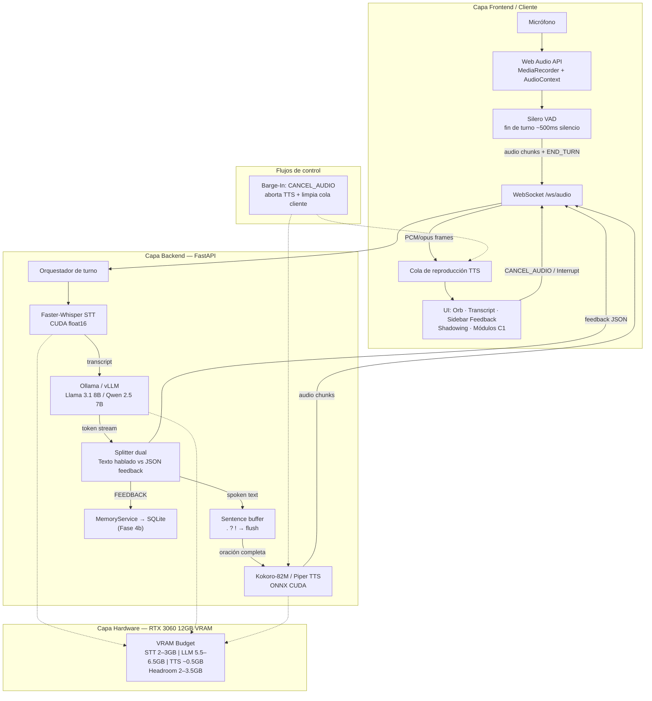
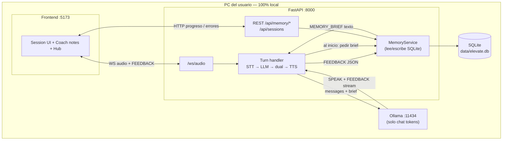
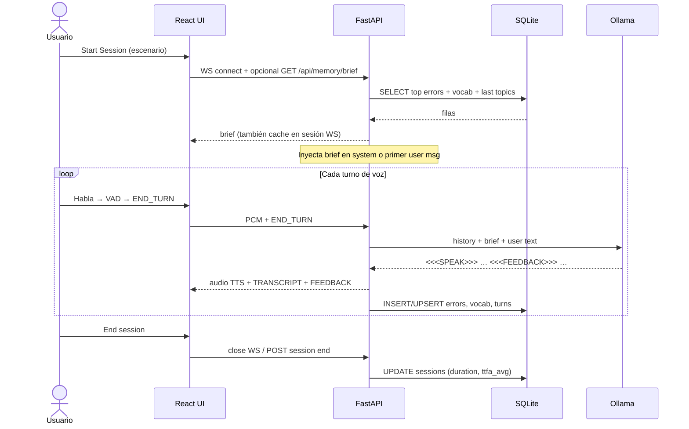

# Architecture — Local AI English Voice Tutor (Codybot)

> **Documentación oficial del sistema** y **guía de estudio senior** para comprender cómo opera una aplicación de IA de voz 100% local y de baja latencia.
>
> Producto: **Elevate AI** · Hardware objetivo: **NVIDIA GeForce RTX 3060 (12 GB VRAM)**  
> Fuentes: [`prd.md`](prd.md), implementación en este repositorio, mediciones reales en RTX 3060 12GB.  
> Diagrama: [`assets/architecture-pipeline.png`](assets/architecture-pipeline.png) (también en el README raíz).

---

## 1. Visión General del Proyecto

### 1.1 Propósito e Idea Central

**Elevate AI** (arquitectura tipo Codybot) es un **tutor de inglés por voz** que corre **enteramente en el PC del usuario**. No envía audio ni texto a APIs cloud (OpenAI, Deepgram, ElevenLabs, etc.).

| Dimensión | Definición del producto |
|-----------|-------------------------|
| **Qué es** | Pipeline voz→texto→razón→voz con tutor pedagógico C1 |
| **Problema que resuelve** | Práctica oral continua sin suscripciones, sin latencia de red y sin ceder datos de voz |
| **Filosofía** | $0/mes · privacidad total · respuesta voz-a-voz objetivo **~1.5–2.0 s** |
| **Usuario** | Hispanohablante B1/B2 que quiere fluidez profesional C1 |

La idea central no es “otro chatbot con micrófono”, sino un **sistema embebido de IA multimodal ligera** donde tres motores (STT, LLM, TTS) conviven en la misma GPU con un presupuesto de VRAM estricto y un contrato de latencia duro.

### 1.2 Casos de Uso y Enfoque Pedagógico

El sistema empuja al alumno desde **inglés intermedio conversacional** hacia **inglés profesional (C1)** mediante:

1. **Inmersión conversacional** — 100% inglés por defecto; español solo si el usuario lo pide o se atasca.
2. **Feedback no disruptivo** — correcciones gramaticales, de phrasing y de pronunciación llegan como **metadatos JSON** a una sidebar, sin interrumpir el flujo oral.
3. **Shadowing (“Escucha y Repite”)** — cuando se detecta mala articulación, se genera una tarjeta con la frase nativa + reintento por micrófono.
4. **Roleplay C1** — entrevistas senior, negociación, pitch técnico, defensa de arquitectura.
5. **Memoria activa** — historial de errores recurrentes y vocabulario C1 consolidado (Fase 4).

Pedagógicamente, el diseño separa **canal hablado** (corto, natural, 1–3 párrafos) de **canal analítico** (JSON estructurado). Así el oído practica fluidez mientras la vista recibe corrección de precisión.

### 1.3 Estado de implementación (contexto del repo)

| Fase | Objetivo | Estado |
|------|----------|--------|
| **1** | Entorno CUDA + prueba STT→LLM→TTS | **Hecha** (warm ~3.3 s batch) |
| **2** | FastAPI WebSockets + streaming + barge-in | **Hecha** (`/ws/audio`, TTFA ~2.1 s) |
| **3** | Frontend Web Audio / UI React | **MVP** (`frontend/` Vite+React; VAD energía; estética Booth pendiente) |
| **4a** | Canal dual SPEAK/FEEDBACK + Coach notes | **Hecha** (`dual_channel.py` + panel UI) |
| **4b** | Memoria SQLite entre sesiones | **Diseñada** (ver §9) — pendiente de código |
| **4c** | Shadowing | Pendiente |

**Cómo se corre hoy:** backend `uvicorn` en `:8000` + frontend `npm run dev` en `:5173`. La ruta `:8000/` sigue sirviendo la demo HTML de Fase 2; la app de producto es `:5173`.

---

## 2. Stack Tecnológico y Librerías (Diccionario Técnico y Justificación)

Para cada pieza: **(a)** definición y capa, **(b)** función en el pipeline, **(c)** por qué se eligió.

---

### 2.1 Core & Backend

#### Python 3.11+ (en este repo: 3.12)

| | |
|--|--|
| **a) Definición** | Runtime del backend. Capa de orquestación y bindings a CUDA/ONNX. |
| **b) Función** | Hostea FastAPI, servicios STT/LLM/TTS, scripts de benchmark y bootstrap CUDA. |
| **c) Por qué** | Ecosistema ML maduro (`torch`, `ctranslate2`, `onnxruntime`). **Python 3.14 se descartó** en este proyecto: wheels de torch/ctranslate2 aún inestables o inexistentes. |

#### FastAPI

| | |
|--|--|
| **a) Definición** | Framework ASGI de APIs HTTP/WebSocket sobre Starlette + Pydantic. |
| **b) Función** | Expone `/health`, `/api/config` y (Fase 2) `/ws/audio` para audio bidireccional. |
| **c) Por qué** | Nativo async + WebSockets sin glue pesado; tipado con Pydantic Settings; ideal para streaming de tokens y chunks de audio frente a Flask/Django sincrónicos. |

#### WebSockets

| | |
|--|--|
| **a) Definición** | Canal full-duplex sobre TCP (frames texto/binario). |
| **b) Función** | Sube chunks de audio del micrófono; baja audio TTS + eventos (`CANCEL_AUDIO`, transcripts, feedback JSON). |
| **c) Por qué** | HTTP request/response no sirve para barge-in ni streaming continuo. gRPC sería overkill en browser; WebRTC añade complejidad de señalización innecesaria en localhost. |

---

### 2.2 Speech-to-Text (STT): Faster-Whisper

| | |
|--|--|
| **a) Definición** | Reimplementación de OpenAI Whisper sobre **CTranslate2** (inferencia optimizada). Capa de percepción acústica. |
| **b) Función** | Convierte WAV/PCM del turno del usuario en texto inglés. En Phase 1: `medium.en`, `device=cuda`, `compute_type=float16`, `beam_size=1`. |
| **c) Por qué vs Whisper vanilla** | Whisper PyTorch “oficial” es más lento y consume más VRAM. Faster-Whisper + CTranslate2 ofrece **menor latencia**, **float16/int8**, y VAD opcional. En RTX 3060 medimos **~0.59 s** warm para ~6 s de audio. |

**Modelos contemplados**

| Modelo | Uso | Trade-off |
|--------|-----|-----------|
| `medium.en` | Default Phase 1 (inglés) | Mejor latencia/VRAM |
| `large-v3` | Máxima precisión | +VRAM (~3 GB) y +latencia |

---

### 2.3 Motor LLM: Ollama / vLLM + Llama 3.1 / Qwen 2.5

#### Ollama (runtime actual)

| | |
|--|--|
| **a) Definición** | Servidor local de LLMs (HTTP `11434`) con carga de GGUF y gestión de GPU. Proceso **separado** de FastAPI. |
| **b) Función** | Genera la respuesta del tutor + (Fase 4) metadatos de feedback. Cliente en `app/services/llm.py`. |
| **c) Por qué** | Setup trivial en Windows, pull de modelos con un comando, API estable. Suficiente para un solo usuario local. |

#### vLLM (alternativa / futura)

| | |
|--|--|
| **a) Definición** | Motor de serving de alto throughput (PagedAttention). |
| **b) Función** | Misma capa semántica que Ollama, con mejor batching/concurrencia. |
| **c) Por qué (cuándo)** | Si se escala a multi-sesión o se necesita TTFT más agresivo. En desktop single-user, Ollama gana en simplicidad. |

#### Modelos y cuantización

| Modelo | Rol |
|--------|-----|
| **Llama 3.1 8B Instruct** | Default verificado (`llama3.1:8b`) — buen inglés conversacional |
| **Qwen 2.5 7B Instruct** | Alternativa fuerte en instrucciones y estructura |
| **Qwen 2.5 VL 7B** | Reservado para escenarios con diagramas/imágenes |

**Cuantización `Q4_K_M` / `Q5_K_M` (GGUF)**

- Comprime pesos de FP16 (~16 bit) a ~4–5 bit por peso con esquemas *K-quants* (mezcla de bloques).
- **Q4_K_M**: menos VRAM, algo más de pérdida de calidad.
- **Q5_K_M**: mejor fidelidad; encaja en el presupuesto **~5.5–6.5 GB** del PRD junto a STT+TTS.
- Sin cuantización, un 8B FP16 solo ya se come ~16 GB → **imposible** en 3060 12GB junto al resto del pipeline.

**Medición Phase 1 (warm):** LLM ~**0.90 s** para respuesta corta. Cold start Ollama: **~60–80 s** (carga a VRAM).

---

### 2.4 Text-to-Speech (TTS): Kokoro-82M y Piper

#### Kokoro-82M (preferido)

| | |
|--|--|
| **a) Definición** | Modelo TTS compacto (~82M params), calidad muy alta; aquí vía **kokoro-onnx** + `onnxruntime-gpu`. |
| **b) Función** | Sintetiza la respuesta hablada del tutor (voz p.ej. `af_sarah`). |
| **c) Por qué** | Mejor ratio calidad/velocidad/VRAM (~0.5 GB) que Tortoise/XTTS. Ideal para sentence-level streaming. |

#### Piper TTS (fallback)

| | |
|--|--|
| **a) Definición** | TTS ONNX ligero (ecosistema Rhasspy). |
| **b) Función** | Respaldo si Kokoro falla o falta el modelo. |
| **c) Por qué** | Dependencias mínimas, predecible, bueno como red de seguridad aunque menos “humano”. |

**Nota de ingeniería Windows:** `onnxruntime-gpu` 1.29+ exige CUDA 13; este proyecto fija **`onnxruntime-gpu==1.20.2`** (CUDA 12.x) y expone DLLs de `torch/lib` vía `app/utils/cuda_bootstrap.py`.

---

### 2.5 Frontend & Audio Management

#### Web Audio API (`MediaRecorder`, `AudioContext`)

| | |
|--|--|
| **a) Definición** | APIs del navegador para captura, procesamiento y reproducción de audio. Capa cliente (Fase 3). |
| **b) Función** | Grabar micrófono → frames binarios por WebSocket; reproducir chunks TTS con baja latencia. |
| **c) Por qué** | Estándar web, sin Electron obligatorio; permite buffer/queue y barge-in limpiando el grafo de audio. |

#### Silero VAD (Voice Activity Detection)

| | |
|--|--|
| **a) Definición** | Modelo ligero que clasifica voz vs silencio. Idealmente **en el cliente**. |
| **b) Función** | Detectar fin de turno (~500 ms de silencio) y emitir *end-of-utterance* antes de STT. |
| **c) Por qué** | Evita cortes prematuros (umbral fijo de energía) y reduce falsos finales. Corre en CPU del cliente → no pelea VRAM con el tutor. |

#### UI (React/Next/Vite + Tailwind o Electron)

Dashboard con orb de estado, botón Interrupt, transcript live, sidebar de feedback, módulos C1 y shadowing. Fase 3+.

---

## 3. Presupuesto y Gestión de Recursos de Hardware (GPU / VRAM)

### 3.1 Presupuesto en RTX 3060 12 GB

```
VRAM total física                          12.0 GB
─────────────────────────────────────────────────
STT  Faster-Whisper medium.en FP16      2.0–3.0 GB
LLM  Llama/Qwen 7–8B Q4/Q5              5.5–6.5 GB
TTS  Kokoro / Piper                     ~0.5 GB
─────────────────────────────────────────────────
Activo típico                           8.5–10.0 GB
Headroom (KV-cache, UI, drivers, picos) 2.0–3.5 GB
```

### 3.2 Qué ocurre en memoria durante STT + LLM + TTS

En el diseño **warm** (modelos ya cargados):

1. **Pesos residentes** de los tres motores ocupan la mayor parte del presupuesto.
2. Durante un turno:
   - STT asigna buffers de espectro/encoder temporales.
   - LLM crece el **KV-cache** con el contexto de conversación.
   - TTS materializa mel/waveform (Kokoro ONNX) en bloques pequeños.
3. Idealmente **no se descargan** modelos entre turnos: el coste de cold-load domina (Ollama lo demostró con 60–80 s).

### 3.3 Rol del headroom (evitar OOM)

El margen de **2–3.5 GB** absorbe:

- Crecimiento del contexto LLM (diálogos largos).
- Picos de activación en `large-v3` o batch accidental.
- Overheads de Windows + driver NVIDIA + UI.
- Futuro procesamiento de imagen (Qwen-VL).

**Si se satura la VRAM:** CUDA OOM → crash del proceso o fallback a CPU (latencia inaceptable). Mitigaciones: cuantizar más (Q4), bajar Whisper a `small.en`, acortar `num_predict`/contexto, o descargar TTS a CPU (último recurso).

### 3.4 Mediciones reales Phase 1 (referencia)

| Métrica | Valor |
|---------|-------|
| GPU | RTX 3060 12 GB · torch 2.6.0+cu124 |
| STT warm | ~0.59 s |
| LLM warm | ~0.90 s |
| TTS warm | ~0.8–1.4 s |
| Total batch (sin streaming) | ~3.3 s |
| Objetivo producto (streaming) | ≤ 2.0 s a primer audio |

El gap 3.3 → ≤2.0 **no se cierra esperando que el batch sea más rápido**, sino con **sentence-level streaming** (sección 5).

---

## 4. Diagrama de Arquitectura de Sistema (Mermaid.js)




---

## 5. Interconexión y Flujo de Datos End-to-End

### 5.1 Traza del paquete de datos (micrófono → oído)

```
1. Captura
   Mic → MediaRecorder/AudioWorklet
   Formato típico: PCM_16 LE, 16 kHz mono (o resample a lo que pida Whisper)

2. Transporte uplink
   Cliente fragmenta PCM en Binary WebSocket frames
   + eventos texto JSON: { "type": "END_TURN" } tras VAD

3. STT
   Backend concatena frames → buffer / WAV temporal
   Faster-Whisper → string UTF-8 (transcript)

4. LLM
   POST/stream a Ollama /api/chat
   Salida: token stream con bloques <<<SPEAK>>> + <<<FEEDBACK>>>

5. Dual parse (`dual_channel.py`)
   Canal A — texto hablable → sentence buffer → TTS
   Canal B — JSON feedback → evento WS FEEDBACK → sidebar (+ futuro SQLite)

6. TTS
   Cada oración flush → Kokoro/Piper → samples float32 → PCM_16 chunks

7. Transporte downlink
   Binary frames de audio + eventos { "type": "TRANSCRIPT", ... }

8. Reproducción
   AudioContext encola buffers; el usuario oye mientras el LLM aún genera la siguiente oración
```

**Formatos clave**

| Etapa | Formato |
|-------|--------|
| Captura/cliente | `PCM_16`, a veces WebM/Opus intermedia |
| Uplink | WebSocket **Binary Frames** |
| Semántica | Texto / **Text Tokens** |
| Feedback | **JSON Payload** |
| Downlink TTS | **Audio Chunks** (PCM) por WS binario |

### 5.2 Pipeline de latencia ultra-baja (< 2.0 s): Streaming Sentence-Level TTS

En Mode batch (Phase 1):

```
STT(all) → LLM(all) → TTS(all)  ≈ 3.3 s hasta oír nada
```

En Mode streaming (Phase 2 — diseño objetivo):

```
STT(fin de turno) → LLM token a token
                      ↓ al cerrar oración (. ? !)
                   TTS(oración_1) → PLAY  ← aquí empieza el reloj percibido
                      ↓
                   TTS(oración_2) mientras LLM sigue...
```

**Por qué baja la latencia percibida**

- El usuario mide **time-to-first-audio**, no time-to-full-response.
- Si la primera oración sale en ~1.5–2.0 s, la conversación “se siente” en tiempo real aunque el turno completo dure más.
- `beam_size=1`, respuestas cortas del system prompt y `num_predict` acotado reducen TTFT del LLM.

### 5.3 Mecanismo de interrupción (Barge-In)

**Disparadores:** botón Interrupt, o VAD detecta voz del usuario mientras hay playback.

```
Cliente                         Backend
   |-- CANCEL_AUDIO (WS text) ---->|
   |                               |- flag cancel = true
   |                               |- abort generación TTS en curso
   |                               |- deja de encolar oraciones
   |<-- ACK / STATE=idle ----------|
   |- AudioContext.stop()
   |- vaciar cola de buffers
```

Sin barge-in, el tutor “habla por encima” del alumno y rompe la pedagogía conversacional. Es un requisito de producto, no un nice-to-have.

---

## 6. Estrategia de Prompting y Extracción Dual

### 6.1 Prompt de voz (`SPOKEN_TUTOR_PROMPT`)

El camino de producción usa un prompt que **obliga** dos bloques:

```
<<<SPEAK>>>
…texto hablable (1–3 frases)…
<<<FEEDBACK>>>
{"grammar":[…],"phrasing":[…],"pronunciation":[…],"notes":""}
```

Identidad: Elevate AI, tutor C1 para hispanohablantes; respuestas cortas; inglés prioritario.  
`LATENCY_TEST_PROMPT` queda solo para benchmarks de Fase 1.

### 6.2 Audio fluido + JSON estructurado sin romper la voz

**Problema:** si el TTS ve `{` o marcadores, verbaliza basura.

**Solución implementada (`app/ws/dual_channel.py`):**

1. Stream de tokens → `DualChannelSplitter`.
2. Solo el canal SPEAK entra al `SentenceBuffer` → cola TTS.
3. Tras `<<<FEEDBACK>>>` se acumula JSON; al cerrar el turno se emite el evento WS `FEEDBACK`.
4. El historial en RAM (y futuro SQLite) guarda **solo** el texto hablado del assistant.

| Canal | Contenido | Destino |
|-------|-----------|---------|
| **Speak** | Inglés conversacional | TTS + transcript + history LLM |
| **Feedback** | JSON pedagógico | Sidebar Coach notes (+ futuro SQLite) |

Fallback: si el modelo omite marcadores, todo el stream se trata como SPEAK (seguro para la voz).

---

## 7. Preguntas de Autoevaluación y Retos de Ingeniería (Estudio Senior)


### Pregunta 1 — Cold start vs warm path

**Reto:** ¿Por qué el primer turno tras reiniciar Ollama puede costar 60–80 s y los siguientes ~1 s de LLM?

**Explicación:** Los pesos GGUF deben mapearse/cargarse en VRAM (y a veces compilar kernels). Eso no es “inferencia lenta”, es **carga de modelo**.

**Solución:** Mantener Ollama residente; warmup al arrancar FastAPI (`ollama run` / chat vacío); opcionalmente precargar en el `lifespan` de la app. Nunca medir KPIs de producto en cold start.

---

### Pregunta 2 — Saturación del bus PCIe y thrashing de VRAM

**Reto:** Si descargas Whisper a CPU entre turnos para “liberar VRAM”, ¿mejoras o empeoras la latencia?

**Explicación:** Recargar ~2–3 GB por PCIe en cada turno añade cientos de ms o segundos y satura el bus. En 12 GB el diseño correcto es **co-residencia** con headroom, no ping-pong.

**Solución:** Cuantizar LLM, no evictar STT; perfilar con `nvidia-smi`; fijar presupuesto y alertar si headroom < 1.5 GB.

---

### Pregunta 3 — Concurrencia en una sola GPU

**Reto:** ¿Qué pasa si STT de un turno nuevo y TTS del turno anterior pelean CUDA streams a la vez (barge-in imperfecto)?

**Explicación:** Una 3060 no es un cluster. Contención de SM/memoria → jitter y a veces OOM.

**Solución:** Cola serializada por sesión; al `CANCEL_AUDIO`, **sincronizar** cancelación TTS antes de aceptar nuevo STT; un solo “owner” del contexto CUDA por usuario.

---

### Pregunta 4 — Por qué el batch ~3.3 s no cumple el KPI de 2.0 s

**Reto:** Optimizar microsegundos en Kokoro no bastará. ¿Cuál es el cuello de botella arquitectónico?

**Explicación:** En batch, el usuario espera la **suma** STT+LLM+TTS. El KPI de producto es **time-to-first-audio**.

**Solución:** Sentence-level TTS + stream de tokens; VAD agresivo pero estable; primera oración del LLM deliberadamente corta (“Sure — let's sharpen your interview English.”).

---

### Pregunta 5 — Dual output sin envenenar el TTS

**Reto:** El modelo devuelve `{"grammar":...}` pegado al saludo. ¿Qué falla y cómo lo diseñas?

**Explicación:** El sintetizador verbaliza sintaxis. Además el sentence splitter puede fragmentar mal el JSON.

**Solución:** Canales separados (delimitadores / 2-pass / tools); tests de contrato que fallen si el spoken channel contiene `{`/`}`; never pipe feedback al TTS.

---

## 8. Mapa mental rápido (cheat sheet)

```
Privacidad + $0 + <2s percibidos
        ↓
Tres motores co-residentes en 12GB
        ↓
Cliente: VAD + WS + barge-in + Coach notes
        ↓
Servidor: STT → LLM dual stream → TTS por oración
        ↓
Memoria: RAM (sesión) + SQLite (entre sesiones, vía app)
```

| Documento | Para qué |
|-----------|----------|
| [`prd.md`](prd.md) | Requisitos y plan de fases |
| [`../README.md`](../README.md) / [`../README.es.md`](../README.es.md) | Operación e instalación |
| [`context.md`](context.md) | Memoria de decisiones de sesión |
| [`architecture.md`](architecture.md) | Este manual — sistema + estudio |

---

## 9. Memoria persistente con SQLite (diseño — Fase 4b)

### 9.1 Respuesta directa a las dudas de producto

| Pregunta | Respuesta |
|----------|-----------|
| ¿Dónde vive? | Archivo en el PC del usuario: `data/elevate.db` (cero cloud). |
| ¿Quién consulta SQLite? | **Solo FastAPI** (servicio de memoria). Ni el browser ni Ollama abren la DB. |
| ¿El LLM ejecuta SQL? | **No.** Ollama solo recibe texto. La app lee SQLite y construye un *memory brief* en prosa/JSON corto que se inyecta en el prompt. |
| ¿Cómo se usa al hacer sesiones? | Al **Start Session** (y opcionalmente cada N turnos) la app inyecta el brief. El Hub consulta REST sin LLM. |
| ¿Qué se guarda? | Sesiones, turnos, ítems de feedback (grammar/phrasing/pronunciation), vocabulario C1, rachas. |

Regla de oro: **SQLite = cerebro de largo plazo de la app; el LLM = cerebro de turno, con amnesia salvo lo que la app le cuente.**

### 9.2 Esquema propuesto (tablas)

```
users          id, display_name, level (C1…), created_at
sessions       id, user_id, scenario, started_at, ended_at, duration_s, ttfa_avg
turns          id, session_id, user_text, assistant_text, created_at
errors         id, user_id, kind (grammar|phrasing|pronunciation),
               original, correction, note, count, last_seen_at
vocab          id, user_id, word_or_phrase, context, mastery (0–3), last_seen_at
```

### 9.3 Diagrama de flujo — interconexión



### 9.4 Secuencia de una sesión



### 9.5 Quién hace qué (claridad LLM vs app)

| Acción | Actor | ¿Toca SQLite? |
|--------|-------|----------------|
| Guardar corrección tras un turno | FastAPI `MemoryService` | Sí — write |
| Mostrar rachas / “words flagged” en Hub | FastAPI REST → React | Sí — read |
| Recordar el nombre *dentro* de la misma sesión | History en RAM del WS | No (aún) |
| Recordar errores *entre* días | Brief inyectado al prompt | Read → texto al LLM |
| Elegir qué decir en inglés | Ollama | No |
| Ejecutar `SELECT` / `INSERT` | **Nunca** el LLM | — |

### 9.6 Por qué no dejar que el LLM “consulte” la DB

1. **Latencia:** tool-calling + SQL en cada turno rompe el KPI de ~2 s.
2. **VRAM/contexto:** `num_ctx=2048` no aguanta dumps grandes; el brief debe ser **corto** (~200–400 tokens).
3. **Seguridad/simplicidad:** un solo dueño del esquema (la app); sin SQL injection vía prompt.
4. **Pedagogía:** la app decide ranking (errores más frecuentes, vocab reciente); el LLM solo conversa.

### 9.7 Contrato del *memory brief* (ejemplo)

Texto que la app añadiría al system prompt al abrir sesión:

```
[MEMORY BRIEF — do not read aloud]
User: Angello · Level C1 · Scenario: Job Interview
Recurring slips: "depend of" → "depend on" (×4); articles with uncountables.
C1 targets this week: "leverage", "trade-off", "push back".
Last session: 14 min · focus negotiation tone.
```

Eso cabe en el presupuesto de contexto y da continuidad sin exponer SQL.

---

*Última alineación: Fases 1–4a hechas · dual channel + Coach notes · VAD energía · frontend :5173 · diseño SQLite §9 · RTX 3060 12GB.*
